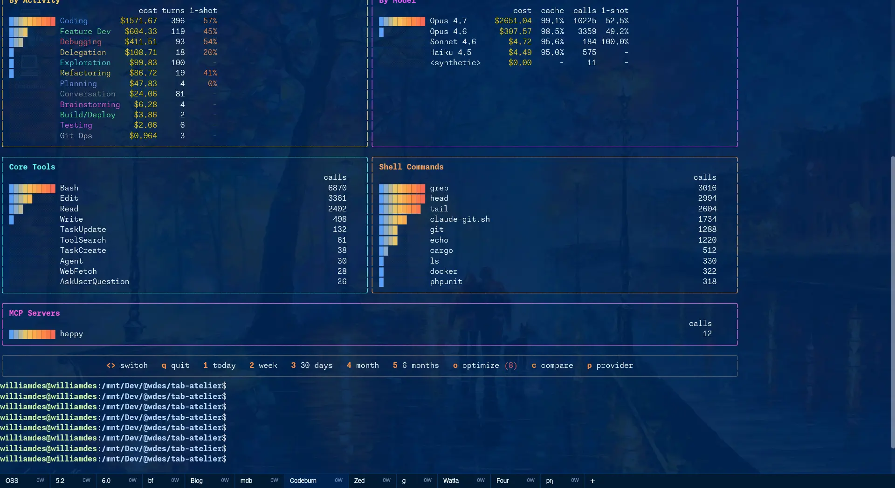
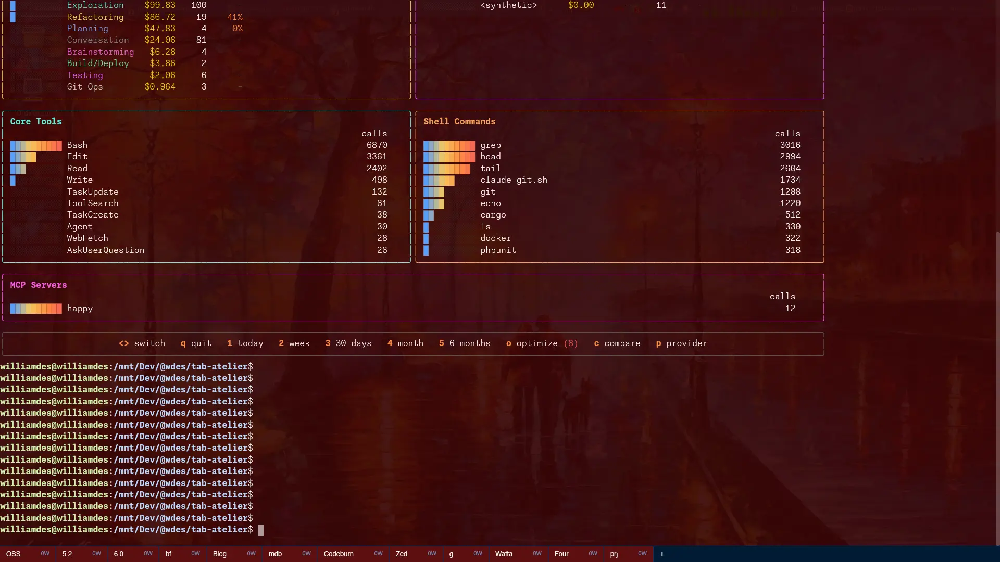

# Tab Atelier

[](https://github.com/wdes/tab-atelier/actions/workflows/build.yml)
[](https://codecov.io/gh/wdes/tab-atelier)


A Guake-style drop-down terminal emulator for Linux (X11), built with Rust using [alacritty_terminal](https://crates.io/crates/alacritty_terminal), [gpui](https://crates.io/crates/gpui) (Zed's GPU-accelerated UI framework), and [wattaouille](https://crates.io/crates/wattaouille) for power monitoring.





## Features

**Terminal**
- Drop-down terminal toggled with global hotkeys (default: **`** and **XF86Calculator**, customizable in preferences)
- Full terminal emulation via alacritty_terminal (colors, scrollback, bracketed paste, ...)
- GPU-accelerated rendering via gpui
- Text selection with mouse, copy/paste from context menu
- Clickable URLs and file paths detected in terminal output
- Reset input & color for misbehaving programs

**Tabs**
- Multiple tabs with drag-and-drop reordering
- Double-click to rename, right-click context menu
- "Copy path" right-click entry copies the tab's working directory to the clipboard
- **Ctrl+Shift+T** to open a new tab (inherits working directory)
- **Alt+Tab** to cycle between tabs
- Shell exit detection with close/respawn confirmation
- Per-tab **agent state LED** to the left of the tab name (thinking / waiting / error / dormant), driven by an in-tab CLI (see [Agent state](#agent-state))

**Session**
- Tabs, working directories, and full terminal output persisted across restarts
- Active tab selection restored on startup
- **Agent auto-resume**: tabs that were running `catbus-agent` or `claude` at last save reopen with `catbus-agent --resume <uuid>` / `claude --resume <uuid>` typed into the freshly-spawned shell

**Preferences**
- Theme selection (Dark, Tomorrow Night Blue)
- Window opacity (1%-100% slider)
- Language (English, French)
- Configurable toggle hotkeys (press any key to register, applied immediately)
- Configurable browser and code editor for opening links

**Monitoring**
- Per-tab CPU usage, power draw (watts), energy consumption (Wh), and uptime
- Low battery warning with visual indicator

**Integration**
- HTTP API (port 7890) + TLS variant (port 7891) with token auth and QR code for remote tab management from a phone
- `tab-atelier set-status` CLI for in-tab tools (agents, hooks, scripts) to publish thinking/waiting/error state to the desktop LED
- `tab-atelier remote …` — mirror tabs from another instance, attach a sidecar terminal, transfer files (sandboxed). See [Remote tabs](#remote-tabs)
- **Headless variant** ships as a separate `tab-atelier-headless.deb` (no gpui / x11rb / qrcode deps, 7.9 MB vs 12 MB) for servers — same HTTP API, no display required
- Wakatime time tracking (reads API key from Zed settings)
- Screenshots (per-tab or full app) saved as BMP

## Installation

### Debian / Ubuntu — apt repo (recommended)

```sh
curl -fsSL https://deb.tab-atelier.wdes.eu/tab-atelier.gpg \
    | sudo tee /usr/share/keyrings/tab-atelier.gpg > /dev/null
echo "deb [signed-by=/usr/share/keyrings/tab-atelier.gpg] https://deb.tab-atelier.wdes.eu stable main" \
    | sudo tee /etc/apt/sources.list.d/tab-atelier.list > /dev/null
sudo apt update
sudo apt install tab-atelier            # desktop / GUI
# or:
sudo apt install tab-atelier-headless   # display-less server variant
```

Replace `stable` with `nightly` to track `main` (versions look like `0.4.0~nightly20260527.123000-1` — the `~` makes them sort strictly **before** the next stable release per [Debian Versioning](https://wiki.debian.org/Versioning), so apt auto-downgrades-then-upgrades on the next stable bump).

The two packages **conflict by design** (they both ship `/usr/bin/catbus-agent`). `apt install tab-atelier-headless` after `tab-atelier` swaps cleanly; `dpkg -i …` on both at once is what produced the file-collision error you saw on early `.deb` builds.

### Setting up the apt repo (maintainer)

```sh
./scripts/setup-apt-publishing.sh
```

Generates an `ed25519` signing key dedicated to this repo (NOT a personal key), uploads its private half + fingerprint to `APT_SIGNING_KEY` / `APT_SIGNING_KEY_ID` via `gh secret set` (private bytes pipe straight into `gh`, never written to disk), enables GitHub Pages on the `gh-pages` branch, and points the API-side `cname` at `deb.tab-atelier.wdes.eu`. The DNS `CNAME` record still has to be added by hand at the user's DNS provider; the script reports the expected target.

The key's User ID is just `tab-atelier release signing` — **no email**. RFC 4880 §5.11 lets a User ID be any UTF-8 string, and `apt`'s `[signed-by=…]` verifies via fingerprint only (see `apt-secure(8)`). Public keyservers like `keys.openpgp.org` require an email for uploads, but we publish the public key directly at `https://deb.tab-atelier.wdes.eu/tab-atelier.gpg` so users `curl` it — no keyserver path involved. `APT_SIGNING_KEY_ID` therefore holds the 40-char fingerprint, not an email, which is what `gpg --local-user` actually wants anyway.

The public half is exported to `assets/tab-atelier-release.gpg` for reference; the same key is re-exported onto `gh-pages` by every workflow run so users can `curl` it.

The script also drops a **revocation certificate** at `$XDG_CONFIG_HOME/tab-atelier/apt-signing-revocation.asc` (mode 600). Move that file off the machine — encrypted USB, password manager, printout — so a compromised laptop doesn't take the kill-switch with it. If the live key ever leaks, `gpg --import` the cert, re-export the public key (now with the revocation signature baked in), and replace `tab-atelier.gpg` on `gh-pages`. Clients re-fetch the key on `apt update` and refuse the now-revoked signature.

### Build from source

```sh
cargo build --release
# Binary at target/release/tab-atelier
```

Requires Rust 2024 edition (rustc 1.92+).

### Debian package — local build

```sh
cargo deb                                         # → tab-atelier_*.deb
cargo deb -p tab-atelier --variant headless       # → tab-atelier-headless_*.deb
sudo apt install ./target/debian/tab-atelier_*.deb
```

The `.deb` lays out the following under FHS-standard paths:

| Path | Permission | Contents |
|---|---|---|
| `/usr/bin/tab-atelier` | `0755` | The binary |
| `/usr/share/applications/tab-atelier.desktop` | `0644` | Desktop entry (registers Tab Atelier in app launchers) |
| `/usr/share/icons/hicolor/scalable/apps/tab-atelier.svg` | `0644` | App icon (scalable SVG, picked up by the desktop environment via the `Icon=tab-atelier` line in the .desktop) |
| `/usr/share/doc/tab-atelier/` | `0644` | `README.md`, `LICENSE`, `copyright` |

**`conffiles` (per [debian-policy §10.7.2](https://www.debian.org/doc/debian-policy/ch-files.html#behavior)):** none. tab-atelier ships no system-wide configuration in `/etc`, so dpkg has no files to track between upgrades. All user-modifiable state — preferences, tab list, scrollback, uptime, energy, single-instance lock — lives under the user's `$XDG_CONFIG_HOME` and `$XDG_STATE_HOME` (see [State](#state) below). The package's `conf-files = []` in `Cargo.toml` records this intentionally.

**`dirs` (per [debian-policy §10.5](https://www.debian.org/doc/debian-policy/ch-files.html#permissions-and-owners)):** the package creates only what it installs (under `/usr/bin`, `/usr/share/applications`, `/usr/share/icons/hicolor/scalable/apps`, `/usr/share/doc/tab-atelier`). It does **not** pre-create any directory under `/etc` or `/var`. The per-user `~/.config/tab-atelier/` and `~/.local/{,state/}tab-atelier/` directories are created lazily by the running application on first save — dpkg never touches them, so a `dpkg --purge` leaves them in place for the user to remove manually if desired.

## Running

```sh
tab-atelier               # normal mode
tab-atelier --read-only   # second instance, no writes
```

A normal launch acquires a single-instance lock on `~/.local/state/tab-atelier/tab-atelier.lock` and exits if another normal instance is already running — concurrent writers would race each other and produce inconsistent state files.

`--read-only` skips the lock so any number of read-only instances can run alongside the primary one. In that mode tab-atelier never writes anything: no `tabs.json` rewrites, no per-tab output / uptime / energy files, no preference saves, no rename-time file moves. The preferences "Save" button is visually disabled. Useful for snapshotting the running workspace from a script or for poking around without disturbing live state.

### Headless variant

For servers (no display, no gpui), install `tab-atelier-headless.deb` instead. Same HTTP API, same persistence files, same `set-status` / `tabs` / `remote` CLI subcommands — just no window. Ships with a systemd user unit:

```sh
systemctl --user enable --now tab-atelier-headless
```

The headless binary holds the same `tab-atelier.lock` as the GUI, so the two CANNOT run concurrently for the same user (they'd race on `tabs.json` etc.).

## Configuration

### Font settings

Tab Atelier reads font configuration from your Zed editor settings:

**File:** `$XDG_CONFIG_HOME/zed/settings.json` (defaults to `~/.config/zed/settings.json`)

| Setting              | Description                  | Default      |
|----------------------|------------------------------|--------------|
| `ui_font_family`     | Terminal font family         | `monospace`  |
| `ui_font_weight`     | Font weight (100-900)        | `400`        |
| `ui_font_size`       | Font size in pixels          | `16`         |
| `buffer_font_size`   | Fallback if no ui_font_size  | `16`         |
| `scroll_sensitivity` | Scroll speed multiplier      | `1.0`        |

**Font weight tip.** When `ui_font_weight` is something other than a multiple of 100 that maps to a real static face (e.g. `250`), use a **variable** font family — fontconfig otherwise picks the closest static face per glyph and rarely-used codepoints (`€`, `—`, …) can end up in a different face than the digits next to them, which reads as "uneven bold". `scripts/install-monaspace.sh` installs Monaspace v1.400 (variable build) into `~/.local/share/fonts/Monaspace/`; pair it with `"ui_font_family": "Monaspace Neon Var"`.

### Preferences

In-app preferences (theme, opacity, language, browser, code editor) are stored in:

**File:** `$XDG_CONFIG_HOME/tab-atelier/preferences.json` (defaults to `~/.config/tab-atelier/preferences.json`)

### State

Tab Atelier splits persisted state across four files to keep a bad write to any one piece from corrupting the rest. Each file is written atomically (`.tmp` + `fsync` + rename) with rotated backups (`.bak`, `.bak.1`, `.bak.2`).

| Data | Path | Notes |
|---|---|---|
| Tab list, working directories, active index | `~/.local/tab-atelier/tabs.json` | Tiny, rewritten on every persist tick (~2 s) |
| Per-tab terminal scrollback | `~/.local/state/tab-atelier/output_tab-<sanitized>-<crc32>.json` | One file per tab. Rewritten on every persist tick |
| Per-tab uptime (active seconds) | `~/.local/state/tab-atelier/uptime_tab-<sanitized>-<crc32>.json` | One file per tab. **Throttled to once every 30 s**; final value flushed on shutdown |
| Per-tab energy (Wh) | `~/.local/state/tab-atelier/power_tab-<sanitized>-<crc32>.json` | One file per tab. **Throttled by delta (≥ 0.1 Wh consumed)**; final value flushed on shutdown |
| Single-instance lock | `~/.local/state/tab-atelier/tab-atelier.lock` | Empty file. Held via `flock(2)`; released automatically by the kernel on process exit (including crashes), so no manual cleanup needed |

Tab filename = sanitized tab name (non-`[A-Za-z0-9._-]` → `_`) plus an 8-hex-digit CRC32 of the original name, so two tabs whose sanitized forms collide (e.g. `foo/bar` and `foo_bar`) still land in distinct files. Renaming a tab in the UI moves all four files (output, uptime, power, plus their `.bak`s) to the new name's slot so history isn't orphaned.

## Power monitoring

On Intel systems with readable RAPL counters, each tab shows its estimated power usage in the right-click context menu. The estimate uses the same technique as [wattaouille](https://github.com/wdes/wattaouille): `per-tab watts = package watts * (tab CPU jiffies / total system jiffies)`. When RAPL is not available, only CPU percentage is shown.

### Making RAPL readable

Since CVE-2020-8694 (PLATYPUS side-channel) the kernel ships `/sys/class/powercap/intel-rapl/intel-rapl:*/energy_uj` as `mode 400, owned by root`, so a regular user — including the one running tab-atelier — gets `Permission denied`. Symptom: the watts column on every tab card is empty, the stats popover shows CPU% only, and `~/.local/state/tab-atelier/power_tab-*.json` files never get created.

**One-shot for the current boot:**

```sh
sudo chmod -R g+r,o+r /sys/devices/virtual/powercap/intel-rapl
```

**Persistent (every boot)** — drop a udev rule:

```sh
echo 'SUBSYSTEM=="powercap", ACTION=="add", RUN+="/bin/chmod -R g+r,o+r /sys/devices/virtual/powercap/intel-rapl"' | sudo tee /etc/udev/rules.d/99-rapl.rules
sudo udevadm control --reload
sudo udevadm trigger --subsystem-match=powercap
```

After either, **restart tab-atelier**. `PowerSensor::detect` runs once at startup, so a mid-session permission fix is only picked up by the next launch.

**What are jiffies?** Jiffies are the Linux kernel's internal time-keeping unit — a counter that increments at a fixed rate (typically 100, 250, or 1000 Hz depending on `CONFIG_HZ`). Each tick, the kernel records CPU time consumed by every process. Per-process jiffies are read from `/proc/[pid]/stat` and total system jiffies from `/proc/stat`. The ratio between them gives the fraction of CPU a tab's shell used, which is multiplied by package power (from Intel RAPL) to estimate per-tab wattage.

## HTTP API

Tab Atelier exposes tab state on `http://<local-ip>:7890` as JSON (and `https://<local-ip>:7891` over TLS with a self-signed cert auto-generated under `~/.local/state/tab-atelier/tls.{crt,key}`). Access requires a bearer token, shown via a QR code in the right-click menu ("Remote control"). The response includes tab names, working directories, active tab index, and per-tab power stats.

Selected routes:

| Method | Path | Purpose |
|---|---|---|
| `GET` | `/tabs` | List tabs (cwd, name, preview, watts, cpu, uptime, agent state) |
| `GET` | `/tabs/{idx}/output` | Tab scrollback (supports `?since=N&crc=…` for delta patching) |
| `POST` | `/tabs/{idx}/input` | Send raw bytes to the tab's PTY |
| `POST` | `/tabs/{idx}/activate` | Switch to a tab |
| `POST` | `/tabs/{idx}/rename` | Rename a tab |
| `POST` | `/tabs/by-id/{tab_id}/status` | Publish agent state — see [Agent state](#agent-state) |
| `POST` | `/tabs/by-id/{tab_id}/context` | Set/clear the tab's context label (PR/task) — see [Tab context](#tab-context) |
| `POST` | `/tabs/{idx}/files?name=…` | Upload bytes into `<cwd>/inbox/<name>` (see [Remote tabs](#remote-tabs)) |
| `GET` | `/tabs/{idx}/files?path=…` | Download from the tab's `inbox/` or `outbox/` sandbox |
| `DELETE` | `/tabs/{idx}` | Close a tab |
| `POST` | `/tabs/rotate-tokens` | Revoke all per-tab share tokens (share links 401) — master only |
| `POST` | `/master-token/reset` | Hot-swap the master API token (old token 401s) — master only |

Bind addresses for both listeners are configurable in preferences (`api_addr`, `api_tls_addr`); pass `--read-only` to launch a second instance that serves the API but refuses every mutating verb.

Auth errors are content-negotiated: a browser (`Accept: text/html`) opening a revoked share link gets a self-contained 401 page (inline CSS + SVG, no external resources); everything else gets `{"error":…}` JSON.

An **OpenAPI 3.1 spec** describes the API: served live (public, no token) at `GET /openapi.yaml` and shipped in the `.deb` at `/usr/share/doc/tab-atelier{,-headless}/openapi.yaml` — point Swagger UI / `openapi-generator` at it.

### Token CLI

So you can use the API and manage share access without hunting for the `api.token` state file:

```sh
tab-atelier token              # print the master API token (stdout) + URL hint (stderr)
curl -s "$(tab-atelier token | head -1)" ...   # TOKEN=$(tab-atelier token) is scriptable
tab-atelier rotate-tokens      # revoke every tab's share tokens → existing share links 401
tab-atelier reset-master-token # rotate the master token live (no restart) → old token 401s
```

`/tabs` also reports a `viewers` count per tab (how many web/remote viewers are attached); the headless `tabs` listing shows it as `👁 N`, and the desktop dormant-LED treats a watched tab as "tended".

## Remote tabs

`tab-atelier` can mirror tabs from another `tab-atelier` / `tab-atelier-headless` instance. Useful for keeping long-running agents on a server and driving them from the laptop, file transport included.

Endpoints persist in `~/.config/tab-atelier/preferences.json` under `remote_endpoints` (each one has `label`, `url`, `token`, `cert_sha256` for TOFU pinning, `autoconnect`).

### CLI subcommands

```sh
# Add a remote — captures the TLS cert fingerprint via TOFU.
tab-atelier remote add --label colossus \
                       --url https://colossus.lan:7891 \
                       --token <bearer>

# List + remove
tab-atelier remote list
tab-atelier remote remove colossus

# One-shot tab list (handy for scripts)
tab-atelier remote test colossus

# Live "what's running over there" view
tab-atelier remote watch colossus

# Re-capture the cert after a renewal (Ctrl-C-safe)
tab-atelier remote re-pin colossus
```

### Sidecar attach — drive a single remote tab from your terminal

```sh
tab-atelier remote attach colossus build       # or `#3`, or the UUID
```

The local terminal switches to raw mode. Stdin bytes → `RemoteCommand::SendInput`. Remote scrollback deltas → stdout, with SGR escapes intact (the relay re-serialises alacritty's grid as ANSI). `Ctrl-Q` detaches; `Ctrl-C` is forwarded to the remote process. Polling cadence is ~250 ms — type-then-see is noticeably slower than a local shell but workable for `cargo build` / `pytest` / agent sessions.

### File transport — `put` / `get`

```sh
# Upload — lands at <remote tab cwd>/inbox/<basename>
tab-atelier remote put colossus ./input.csv --tab build

# Download — remote path MUST start with inbox/ or outbox/
tab-atelier remote get colossus outbox/result.csv --tab build -o ./result.csv
```

**The file routes are sandboxed.** Even with a valid bearer token, a client can only:
- write to `<tab cwd>/inbox/<basename>` (no `..`, no path separators in the name)
- read from `<tab cwd>/inbox/…` or `<tab cwd>/outbox/…` (no `..`, no absolute paths, symlinks pointing out are 403'd)

Anything else — your source tree, `~/.ssh/`, `/etc/passwd`, `.git/config` — is unreachable through this API. If you need broader file access, set up a dedicated `inbox/` symlink at agent-startup time and the agent can stash references inside it.

### Cert renewal

The relay rotates its self-signed cert ~30 days before expiry (see `cert_needs_renewal` in `src/api.rs`). On the next `attach` / `put` / `get` the CLI prints a warning when the live fingerprint no longer matches the pinned `cert_sha256`:

```
⚠ pinned cert fingerprint for colossus has changed.
  pinned: <old hex>
  live:   <new hex>
  run `tab-atelier remote re-pin colossus` to accept the new cert.
```

The connection is allowed through (Phase 2 uses `disable_verification` on the wire) — the warning is the opt-in signal for the user to ack the rotation. Phase 3 will store the cert DER and switch to strict pinning, at which point the warning becomes a hard refuse-until-repinned.

## Agent state

Each tab carries an optional **agent state** rendered as a small colored LED to the left of the tab name:

| LED | State | What it means |
|---|---|---|
|  steady teal | `thinking` | agent is actively working (or a tool subprocess is running) |
|  ⇄  blinking amber | `waiting` | agent finished its turn — **your move**. Alternates amber↔grey every 500 ms (same cadence as the low-battery indicator) so it catches the eye without strobing |
|  steady red | `error` | the last turn errored or was aborted |
|  steady blue | _dormant_ | a session is attached but it's been quiet **and** you haven't opened this tab in a while (≈3 min) — so a long-untended agent stands out across dozens of tabs. Opening the tab clears it back to grey |
|  steady grey | _attached, quiet_ | agent CLI lives here, no recent activity, but you've looked at it recently |
| _(hidden)_ | _no session_ | no agent attached to this tab |

The grey/blue-when-idle behaviour means the LED stays visible for the entire life of an attached agent session: once your shell sends a `--session <uuid>` it sticks until the session genuinely ends. After ~2 min of agent silence the transient `thinking`/`waiting`/`error` state is swept and the LED falls back to grey, then to **blue** once the tab has also gone ~3 min without you opening it. Claude Code's `SessionEnd` hook (or a manual `tab-atelier set-status idle`) wipes both the transient state and the durable session attachment so the LED disappears.

State is stored in RAM only (the durable session id, agent kind, and plan-mode flag are persisted to `tabs.json` for auto-resume).

Every PTY tab-atelier spawns gets three env vars so in-tab tools can publish state without configuration:

| Variable | Value |
|---|---|
| `_TAB_ID` | Stable per-tab UUID. Survives renames. |
| `TAB_ATELIER_API_URL` | `http://127.0.0.1:<api_port>` |
| `TAB_ATELIER_API_TOKEN` | Same token shown by the "Remote control" QR code |

### `tab-atelier set-status` CLI

```sh
tab-atelier set-status <state> [--label <hint>] \
                                [--session <uuid>] \
                                [--kind <catbus|claude|…>] \
                                [--plan|--no-plan]

# state: idle | thinking | waiting | error
```

The CLI silently exits 0 when `_TAB_ID` is unset (i.e. invoked outside a tab), so it is safe to call unconditionally from `.bashrc` snippets, agents, or build hooks.

`catbus-agent` calls this internally at each lifecycle point. To get the same LED behaviour out of an external Claude Code session, configure a hook in `~/.claude/settings.json`:

```json
{
  "hooks": {
    "UserPromptSubmit": [
      { "matcher": "", "hooks": [{ "type": "command",
        "command": "bash -c 'sid=$(jq -r .session_id); tab-atelier set-status thinking --kind claude --session \"$sid\"' >/dev/null 2>&1" }] }
    ],
    "Stop": [
      { "matcher": "", "hooks": [{ "type": "command",
        "command": "bash -c 'sid=$(jq -r .session_id); tab-atelier set-status waiting --kind claude --session \"$sid\"' >/dev/null 2>&1" }] }
    ],
    "PermissionRequest": [
      { "matcher": "", "hooks": [{ "type": "command",
        "command": "bash -c 'sid=$(jq -r .session_id); tab-atelier set-status waiting --label permission --kind claude --session \"$sid\"' >/dev/null 2>&1" }] }
    ],
    "StopFailure": [
      { "matcher": "", "hooks": [{ "type": "command",
        "command": "bash -c 'sid=$(jq -r .session_id); tab-atelier set-status error --kind claude --session \"$sid\"' >/dev/null 2>&1" }] }
    ],
    "SessionEnd": [
      { "matcher": "", "hooks": [{ "type": "command",
        "command": "bash -c 'sid=$(jq -r .session_id); tab-atelier set-status idle --kind claude --session \"$sid\"' >/dev/null 2>&1" }] }
    ]
  }
}
```

| Event | State | Why |
|---|---|---|
| `SessionStart` | `waiting` (label `session`) | Claude attached to the tab — LED appears immediately, not only at first prompt |
| `UserPromptSubmit` | `thinking` | You sent a prompt — work has started |
| `PreToolUse` | `thinking` (label `tool`) | Refreshes the LED on every tool call so a long turn never gets reclaimed by the staleness sweep |
| `Stop` | `waiting` | Claude finished its turn, awaiting next prompt |
| `PermissionRequest` | `waiting` (label `permission`) | Claude paused for tool/file approval — needs you |
| `StopFailure` | `error` | Turn aborted (API error, crash) |
| `SessionEnd` | `idle` | Session terminated — clear the LED |

## Tab context

Each tab can carry a free-text **context** label — what the agent in it is working on (a PR, an issue, a task). Hover the tab name in the desktop GUI and the label shows as a tooltip; it's also surfaced on `/tabs` (omitted when unset). Handy when several tabs each run their own Claude and the tab names alone don't tell you which is on what.

An in-tab agent sets it from its own shell — no token needed, the endpoint is auto-discovered from the injected `TAB_ATELIER_API_*` env:

```sh
tab-atelier set-context "PR #3719: dompdf font reproduction"
tab-atelier set-context --tab <id> "labelling a worker I just spawned"
tab-atelier set-context --clear
```

The text is capped at 2000 chars; a whitespace-only value clears it. Like `set-status`, it's safe to call unconditionally — it's a silent no-op (exit 0) when the `TAB_ATELIER_API_*` env isn't present, so a shell rc file or Claude Code hook calling it outside a tab does nothing.

Both `.deb`s wire this automatically: the shipped `/etc/claude-code/managed-settings.json` routes Claude Code's `UserPromptSubmit` through `tab-atelier claude-hook user-prompt` (desktop) / `tab-atelier-headless claude-hook user-prompt` (headless), which stamps the prompt as the tab context, and `SessionEnd` clears it — so any `claude` running in a tab labels its tab with no per-user setup. To do it yourself instead, point a `UserPromptSubmit` hook in `~/.claude/settings.json` at `set-context`, or just ask Claude to run it when it picks up a task.

### Auto-resume on restart

When a tab carries both `agent_kind` and `agent_session_id` in `tabs.json`, the restored tab — about 500 ms after its shell has come up — receives a Ctrl-U followed by the appropriate resume command:

| `agent_kind` | Injected command |
|---|---|
| `catbus` | `catbus-agent --resume <uuid>` (plus ` --plan` if the agent was in plan mode at save time) |
| `claude` | `claude --resume <uuid>` |
| anything else | no-op |

If the agent CLI is no longer on `PATH`, the shell prints `command not found` and the tab is otherwise unaffected.

## Wakatime

Wakatime integration is automatic if your Zed settings contain `wakatime.settings.api-key`. Heartbeats are sent with project detection (walks up to find `.git`).

## Logging

Control log output with the `RUST_LOG` environment variable:

```sh
RUST_LOG=tab_atelier=info cargo run    # Startup, restore, API
RUST_LOG=tab_atelier=debug cargo run   # Verbose
```

## Testing

```sh
cargo test
cargo clippy
```

After a fresh clone, opt-in to the repo's pre-commit hook so CI's
`Check formatting` step can't fail on a freshly-pushed commit:

```sh
git config core.hooksPath .githooks
```

The hook runs `cargo fmt -- --check` and aborts the commit (with the
offending diff) when the tree drifts from rustfmt. Pass `--no-verify`
to skip for a one-off WIP commit.

## License

MPL-2.0

Terminal rendering patterns based on [Zed](https://github.com/zed-industries/zed) (Apache-2.0 / GPL-3.0).
